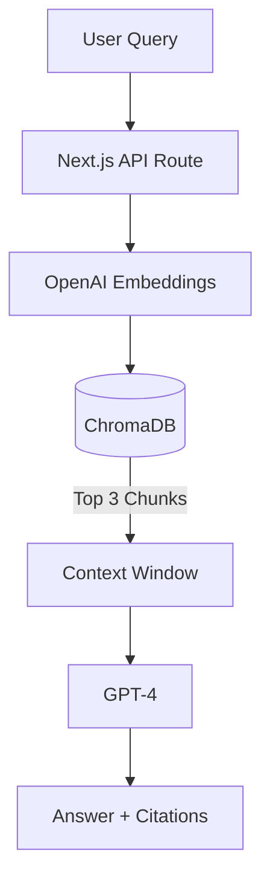

# Design: Enterprise RAG Chatbot

## 1. Architecture



## 2. Component Breakdown

### A. Ingestion Pipeline

- **Library:** LangChain `RecursiveCharacterTextSplitter`.
- **Storage:** Local ChromaDB (for demo) or Pinecone (production).

### B. Retrieval Chain

- **Type:** `RetrievalQA` chain.
- **Prompt:**

  ```text
  You are a helpful assistant. Use the following pieces of context to answer the question at the end.
  If you don't know the answer, just say that you don't know, don't try to make up an answer.

  Context: {context}

  Question: {question}
  ```

## 3. Data Models

### 3.1. Document Chunk

```typescript
interface Chunk {
  id: string;
  content: string;
  metadata: {
    source: string;
    page: number;
  };
  embedding: number[];
}
```
